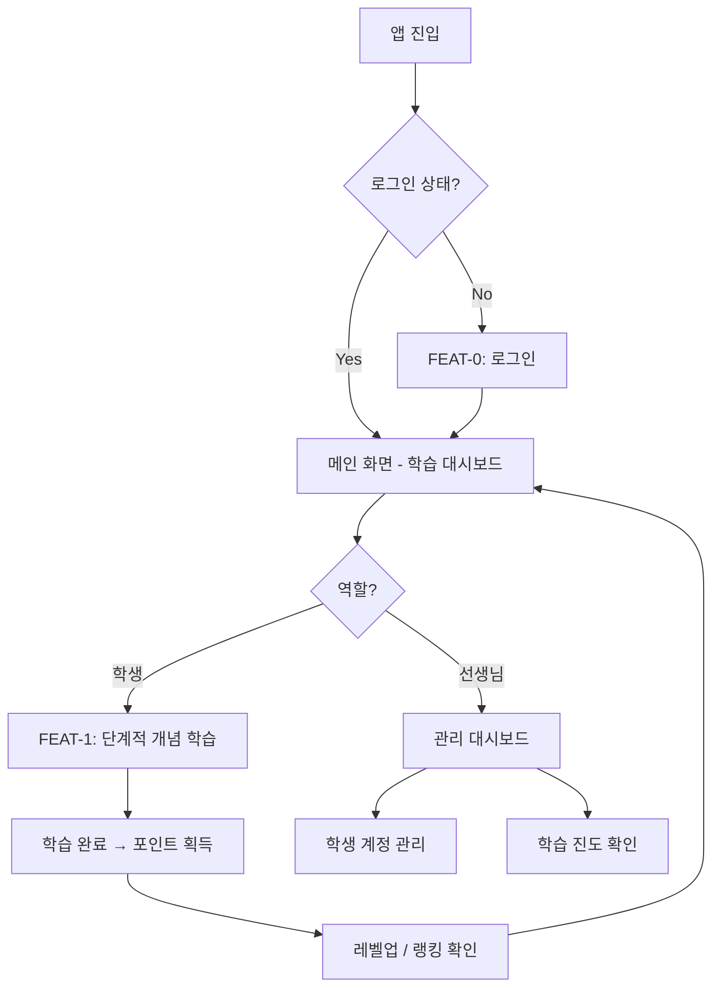
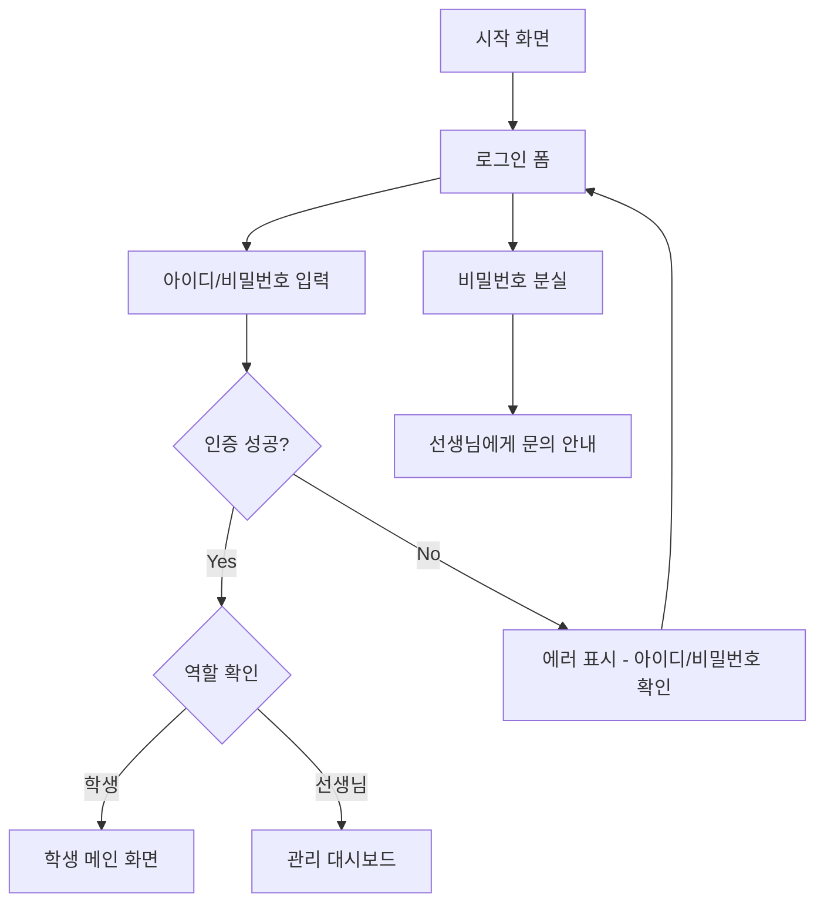
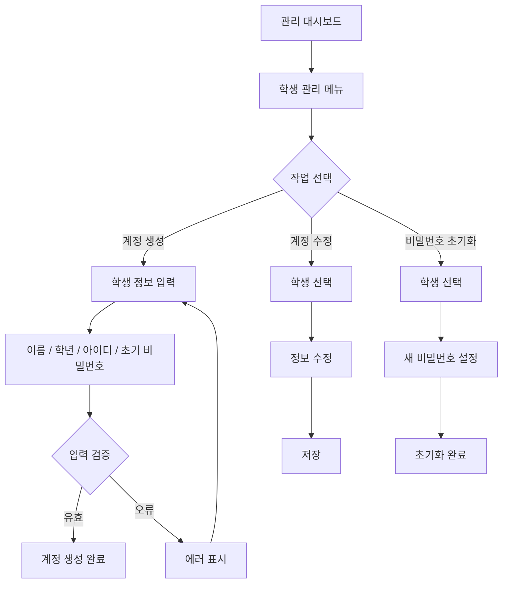
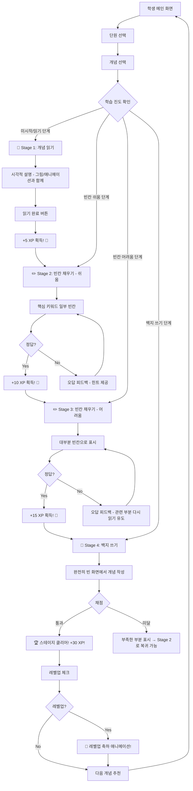
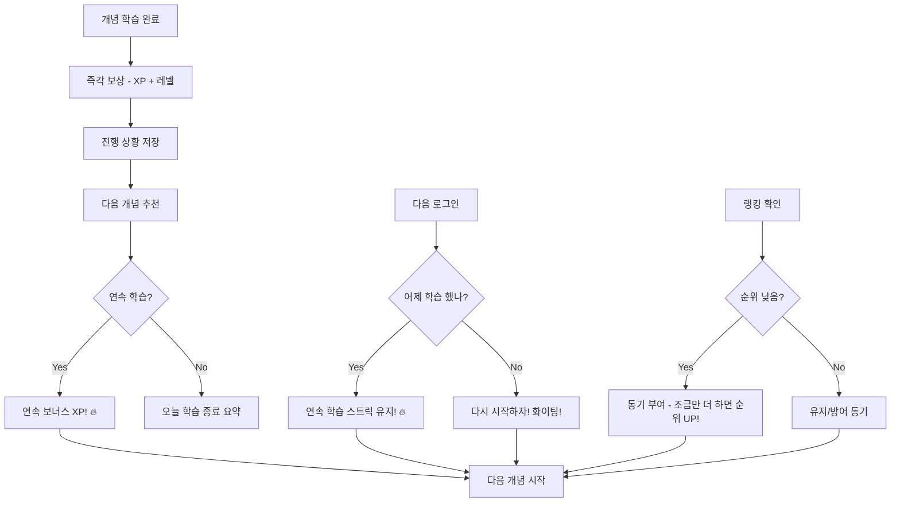

# User Flow (사용자 흐름도) — MathLab

> Mermaid 플로우차트로 핵심 기능의 주요 여정을 표현합니다.

---

## MVP 캡슐

| # | 항목 | 내용 |
|---|------|------|
| 1 | 목표 | 초중등 학생들이 강의 없이 수학 개념을 자기주도적으로 이해할 수 있는 학원용 학습 프로그램 |
| 2 | 페르소나 | 초중등학생 (학원 소속, 수업 전후 자기주도 학습) |
| 3 | 핵심 기능 | FEAT-1: 단계적 개념 학습 (읽기→빈칸→백지) |
| 4 | 성공 지표 (노스스타) | 백지 쓰기 단계까지 도달한 학생 비율 |
| 5 | 입력 지표 | 주간 로그인 횟수, 단계별 완료율 |
| 6 | 비기능 요구 | 모든 기기 반응형 웹 (PC/태블릿/스마트폰) |
| 7 | Out-of-scope | 외부 API 연동, 학부모 카카오톡 알림, 학원 내 상점 |
| 8 | Top 리스크 | 학생들이 초기 흥미를 잃고 사용을 중단할 수 있음 |
| 9 | 완화/실험 | 포인트/랭킹/레벨업 게이미피케이션으로 지속 동기 부여 |
| 10 | 다음 단계 | FEAT-1 단계적 개념 학습 프로토타입 개발 |

---

## 1. 전체 사용자 여정 (Overview)



---

## 2. FEAT-0: 로그인 플로우



---

## 3. FEAT-0: 학생 계정 관리 (선생님) 플로우



---

## 4. FEAT-1: 단계적 개념 학습 플로우 (MVP 핵심)



---

## 5. 게이미피케이션 플로우 (포인트/레벨/랭킹)

```mermaid
graph TD
    A[학습 활동 완료] --> B[포인트(XP) 지급]
    B --> C[누적 XP 업데이트]
    C --> D{레벨업 조건 충족?}

    D -->|Yes| E[레벨업! 🎊]
    E --> F[레벨업 애니메이션 + 보상]
    D -->|No| G[현재 진행 상황 표시]

    F --> H[랭킹 업데이트]
    G --> H

    H --> I[랭킹 보드 반영]
    I --> J{순위 변동?}
    J -->|상승| K[순위 상승 알림! ⬆️]
    J -->|유지/하락| L[다음 순위까지 남은 XP 표시]

    K --> M[메인 화면으로]
    L --> M
```

---

## 6. 리텐션 루프 (습관 형성)



---

## 7. 에러 처리 플로우

```mermaid
graph TD
    A[에러 발생] --> B{에러 유형?}

    B -->|네트워크| C[인터넷 연결을 확인해주세요!]
    B -->|입력 오류| D[빈칸별 에러 표시]
    B -->|세션 만료| E[다시 로그인해주세요]
    B -->|서버 오류| F[잠시 후 다시 시도해주세요]

    C --> G{재시도?}
    G -->|Yes| H[재시도 실행]
    G -->|No| I[오프라인 알림]

    D --> J[학생이 수정]
    J --> K[재제출]

    E --> L[로그인 화면]

    F --> M[자동 재시도 (3회)]
    M --> N{성공?}
    N -->|Yes| O[정상 진행]
    N -->|No| P[선생님에게 알려주세요!]
```

---

## 8. 화면 목록 (Screen Inventory)

| 화면 ID | 화면명 | FEAT | 진입점 | 주요 액션 | 기기 |
|---------|--------|------|--------|----------|------|
| S-01 | 로그인 | FEAT-0 | 앱 진입 | 아이디/비밀번호 입력, 로그인 | 전체 |
| S-02 | 학생 메인 (대시보드) | - | 로그인 후 | 단원 선택, 진도 확인, 랭킹 확인 | 전체 |
| S-03 | 단원 목록 | FEAT-1 | S-02 | 단원 선택, 완료 상태 확인 | 전체 |
| S-04 | 개념 목록 | FEAT-1 | S-03 | 개념 선택, 학습 단계 표시 | 전체 |
| S-05 | 개념 읽기 (Stage 1) | FEAT-1 | S-04 | 시각적 개념 읽기, 완료 | 전체 |
| S-06 | 빈칸 채우기 - 쉬움 (Stage 2) | FEAT-1 | S-05 | 빈칸 입력, 정답 확인 | 전체 |
| S-07 | 빈칸 채우기 - 어려움 (Stage 3) | FEAT-1 | S-06 | 더 많은 빈칸 입력, 정답 확인 | 전체 |
| S-08 | 백지 쓰기 (Stage 4) | FEAT-1 | S-07 | 개념 직접 작성, 채점 | 전체 |
| S-09 | 스테이지 클리어 | FEAT-1 | S-08 | XP 획득, 레벨업, 다음 개념 | 전체 |
| S-10 | 랭킹 보드 | FEAT-1 | S-02 | 순위 확인, 프로필 보기 | 전체 |
| S-11 | 내 프로필 | FEAT-1 | S-02 | 레벨, 총 XP, 학습 통계 | 전체 |
| S-12 | 관리 대시보드 (선생님) | FEAT-0 | 로그인 후 | 학생 관리, 진도 확인 | PC |
| S-13 | 학생 계정 관리 | FEAT-0 | S-12 | 계정 생성/수정/비밀번호 초기화 | PC |

---

## Decision Log 참조

| ID | 항목 | 선택 | UX 영향 |
|----|------|------|---------|
| D-04 | 학습 방법론 | 4단계 (읽기→빈칸쉬움→빈칸어려움→백지) | 화면 4개로 분리, 각 단계마다 보상 피드백 |
| D-05 | 게이미피케이션 | 포인트/레벨/랭킹 | 매 단계 완료 시 XP 애니메이션, 랭킹 보드 화면 추가 |
| D-06 | 계정 관리 | 학원에서 생성·부여 | 회원가입 화면 불필요, 로그인만 존재 |
| D-10 | UI 톤 | 게임 스타일 | "레벨업!", "+10 XP!", "스테이지 클리어!" 등 게임적 피드백 |
