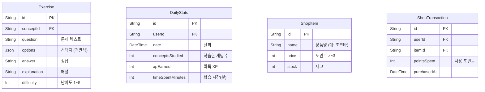

# Database Design (데이터베이스 설계) — MathLab

> Mermaid ERD로 주요 엔티티와 관계를 표현합니다.
> 각 엔티티에 FEAT 주석을 달아 어떤 기능에서 사용되는지 명시합니다.

---

## MVP 캡슐

| # | 항목 | 내용 |
|---|------|------|
| 1 | 목표 | 초중등 학생들이 강의 없이 수학 개념을 자기주도적으로 이해할 수 있는 학원용 학습 프로그램 |
| 2 | 페르소나 | 초중등학생 (학원 소속, 수업 전후 자기주도 학습) |
| 3 | 핵심 기능 | FEAT-1: 단계적 개념 학습 (읽기→빈칸→백지) |
| 4 | 성공 지표 (노스스타) | 백지 쓰기 단계까지 도달한 학생 비율 |
| 5 | 입력 지표 | 주간 로그인 횟수, 단계별 완료율 |
| 6 | 비기능 요구 | 모든 기기 반응형 웹 (PC/태블릿/스마트폰) |
| 7 | Out-of-scope | 외부 API 연동, 학부모 카카오톡 알림, 학원 내 상점 |
| 8 | Top 리스크 | 학생들이 초기 흥미를 잃고 사용을 중단할 수 있음 |
| 9 | 완화/실험 | 포인트/랭킹/레벨업 게이미피케이션으로 지속 동기 부여 |
| 10 | 다음 단계 | FEAT-1 단계적 개념 학습 프로토타입 개발 |

---

## 1. ERD (Entity Relationship Diagram)

```mermaid
erDiagram
    %% FEAT-0: 사용자 관리
    User {
        String id PK "cuid"
        String username UK "로그인 아이디 (학원에서 부여)"
        String passwordHash "bcrypt 해싱"
        String name "학생/선생님 이름"
        String role "STUDENT | TEACHER | ADMIN"
        Int grade "학년 (1~9, 학생만)"
        String profileImage "프로필 이미지 URL"
        DateTime createdAt "가입일"
        DateTime updatedAt "수정일"
        DateTime deletedAt "탈퇴일 (soft delete)"
    }

    %% FEAT-0: 세션 관리
    Session {
        String id PK
        String userId FK
        String sessionToken UK
        DateTime expires
        DateTime createdAt
    }

    %% FEAT-1: 단원 (교과과정)
    Subject {
        String id PK "cuid"
        String title "단원명 (예: 분수)"
        String description "단원 설명"
        Int gradeLevel "대상 학년"
        Int sortOrder "표시 순서"
        DateTime createdAt
    }

    %% FEAT-1: 개념 (학습 콘텐츠)
    Concept {
        String id PK "cuid"
        String subjectId FK "소속 단원"
        String title "개념명 (예: 분수의 덧셈)"
        String fullContent "전체 개념 설명 (읽기용)"
        Json visualAssets "그림/애니메이션 메타데이터"
        Int sortOrder "표시 순서"
        DateTime createdAt
        DateTime updatedAt
    }

    %% FEAT-1: 빈칸 문제
    BlankExercise {
        String id PK "cuid"
        String conceptId FK "소속 개념"
        Int level "1=쉬움, 2=어려움"
        Json blanks "빈칸 위치와 정답 배열"
        String templateText "빈칸이 포함된 원문 텍스트"
        DateTime createdAt
    }

    %% FEAT-1: 학습 진행 기록
    LearningProgress {
        String id PK "cuid"
        String userId FK "학생"
        String conceptId FK "학습 중인 개념"
        String stage "READING | BLANK_EASY | BLANK_HARD | BLANK_PAGE"
        Boolean completed "해당 단계 완료 여부"
        Int attempts "시도 횟수"
        Int score "점수 (백지 쓰기)"
        DateTime startedAt "단계 시작 시각"
        DateTime completedAt "단계 완료 시각"
        DateTime updatedAt
    }

    %% FEAT-1: 게이미피케이션 - 포인트
    PointTransaction {
        String id PK "cuid"
        String userId FK "학생"
        Int amount "획득/사용 포인트"
        String type "EARN | SPEND"
        String reason "READING_COMPLETE | BLANK_EASY | BLANK_HARD | BLANK_PAGE | BONUS"
        String referenceId "관련 학습 기록 ID"
        DateTime createdAt
    }

    %% FEAT-1: 게이미피케이션 - 학생 프로필 (레벨/총XP)
    StudentProfile {
        String id PK "cuid"
        String userId FK UK "학생 (1:1)"
        Int totalXp "누적 XP"
        Int level "현재 레벨"
        Int currentStreak "연속 학습 일수"
        Int longestStreak "최장 연속 학습 일수"
        DateTime lastActiveAt "마지막 학습 시각"
        DateTime updatedAt
    }

    %% 관계 정의
    User ||--o{ Session : "has"
    User ||--o| StudentProfile : "has"
    User ||--o{ LearningProgress : "tracks"
    User ||--o{ PointTransaction : "earns"
    Subject ||--o{ Concept : "contains"
    Concept ||--o{ BlankExercise : "has"
    Concept ||--o{ LearningProgress : "tracked by"
```

---

## 2. 엔티티 상세 정의

### 2.1 User (사용자) — FEAT-0

| 컬럼 | 타입 | 제약조건 | 설명 |
|------|------|----------|------|
| id | String (cuid) | PK | 고유 식별자 |
| username | String(50) | UNIQUE, NOT NULL | 로그인 아이디 (학원에서 부여) |
| passwordHash | String(255) | NOT NULL | bcrypt 해싱된 비밀번호 |
| name | String(50) | NOT NULL | 이름 |
| role | Enum | NOT NULL, DEFAULT 'STUDENT' | STUDENT / TEACHER / ADMIN |
| grade | Int | NULL | 학년 (1~9, 학생만 해당) |
| profileImage | String(500) | NULL | 프로필 이미지 URL |
| createdAt | DateTime | NOT NULL, DEFAULT now() | 가입일 |
| updatedAt | DateTime | NOT NULL | 최종 수정일 |
| deletedAt | DateTime | NULL | Soft delete용 |

**인덱스:**
- `idx_user_username` ON username (UNIQUE)
- `idx_user_role` ON role

**최소 수집 원칙:**
- 필수: username, name, grade (학생)
- 선택: profileImage
- 수집 안 함: 이메일, 전화번호, 주소, 생년월일 (초중등이므로 최소 개인정보)

### 2.2 Subject (단원) — FEAT-1

| 컬럼 | 타입 | 제약조건 | 설명 |
|------|------|----------|------|
| id | String (cuid) | PK | 고유 식별자 |
| title | String(200) | NOT NULL | 단원명 (예: "분수", "방정식") |
| description | Text | NULL | 단원 설명 |
| gradeLevel | Int | NOT NULL | 대상 학년 |
| sortOrder | Int | NOT NULL, DEFAULT 0 | 표시 순서 |
| createdAt | DateTime | NOT NULL, DEFAULT now() | 생성일 |

**인덱스:**
- `idx_subject_grade` ON gradeLevel
- `idx_subject_sort` ON sortOrder

### 2.3 Concept (개념) — FEAT-1

| 컬럼 | 타입 | 제약조건 | 설명 |
|------|------|----------|------|
| id | String (cuid) | PK | 고유 식별자 |
| subjectId | String | FK → Subject.id, NOT NULL | 소속 단원 |
| title | String(200) | NOT NULL | 개념명 (예: "분수의 덧셈") |
| fullContent | Text | NOT NULL | 전체 개념 설명 (읽기 콘텐츠, Markdown) |
| visualAssets | Json | NULL | 그림/애니메이션 메타데이터 |
| sortOrder | Int | NOT NULL, DEFAULT 0 | 표시 순서 |
| createdAt | DateTime | NOT NULL, DEFAULT now() | 생성일 |
| updatedAt | DateTime | NOT NULL | 수정일 |

**인덱스:**
- `idx_concept_subject` ON subjectId
- `idx_concept_sort` ON (subjectId, sortOrder)

### 2.4 BlankExercise (빈칸 문제) — FEAT-1

| 컬럼 | 타입 | 제약조건 | 설명 |
|------|------|----------|------|
| id | String (cuid) | PK | 고유 식별자 |
| conceptId | String | FK → Concept.id, NOT NULL | 소속 개념 |
| level | Int | NOT NULL | 1=쉬움 (일부 빈칸), 2=어려움 (대부분 빈칸) |
| blanks | Json | NOT NULL | `[{position, answer, hint}]` 형식 |
| templateText | Text | NOT NULL | 빈칸이 `{{1}}`, `{{2}}` 형태로 표시된 원문 |
| createdAt | DateTime | NOT NULL, DEFAULT now() | 생성일 |

**인덱스:**
- `idx_blank_concept_level` ON (conceptId, level)

**blanks JSON 구조:**
```json
[
  { "position": 1, "answer": "분모", "hint": "아래쪽 숫자를..." },
  { "position": 2, "answer": "통분", "hint": "분모를 같게..." }
]
```

### 2.5 LearningProgress (학습 진행) — FEAT-1

| 컬럼 | 타입 | 제약조건 | 설명 |
|------|------|----------|------|
| id | String (cuid) | PK | 고유 식별자 |
| userId | String | FK → User.id, NOT NULL | 학생 |
| conceptId | String | FK → Concept.id, NOT NULL | 학습 중인 개념 |
| stage | Enum | NOT NULL | READING / BLANK_EASY / BLANK_HARD / BLANK_PAGE |
| completed | Boolean | NOT NULL, DEFAULT false | 해당 단계 완료 여부 |
| attempts | Int | NOT NULL, DEFAULT 0 | 시도 횟수 |
| score | Int | NULL | 백지 쓰기 점수 (0~100) |
| startedAt | DateTime | NOT NULL, DEFAULT now() | 단계 시작 시각 |
| completedAt | DateTime | NULL | 단계 완료 시각 |
| updatedAt | DateTime | NOT NULL | 수정일 |

**인덱스:**
- `idx_progress_user_concept` ON (userId, conceptId) — 학생별 개념 진도 조회
- `idx_progress_user_stage` ON (userId, stage) — 학생별 단계 통계
- `idx_progress_completed` ON (userId, completed) — 완료 현황 집계

**유니크 제약:**
- `uq_progress_user_concept_stage` ON (userId, conceptId, stage) — 학생당 개념당 단계 1개

### 2.6 PointTransaction (포인트 거래) — FEAT-1

| 컬럼 | 타입 | 제약조건 | 설명 |
|------|------|----------|------|
| id | String (cuid) | PK | 고유 식별자 |
| userId | String | FK → User.id, NOT NULL | 학생 |
| amount | Int | NOT NULL | 포인트 양 (+는 획득, -는 사용) |
| type | Enum | NOT NULL | EARN / SPEND |
| reason | String(50) | NOT NULL | 포인트 사유 |
| referenceId | String | NULL | 관련 LearningProgress ID |
| createdAt | DateTime | NOT NULL, DEFAULT now() | 거래 시각 |

**인덱스:**
- `idx_point_user` ON userId
- `idx_point_user_created` ON (userId, createdAt DESC) — 최근 포인트 내역 조회

**포인트 기준 (XP):**
| 활동 | XP |
|------|-----|
| 읽기 완료 (Stage 1) | +5 |
| 빈칸 쉬움 완료 (Stage 2) | +10 |
| 빈칸 어려움 완료 (Stage 3) | +15 |
| 백지 쓰기 완료 (Stage 4) | +30 |
| 연속 학습 보너스 | +5 /일 |

### 2.7 StudentProfile (학생 프로필) — FEAT-1

| 컬럼 | 타입 | 제약조건 | 설명 |
|------|------|----------|------|
| id | String (cuid) | PK | 고유 식별자 |
| userId | String | FK → User.id, UNIQUE | 학생 (1:1) |
| totalXp | Int | NOT NULL, DEFAULT 0 | 누적 XP |
| level | Int | NOT NULL, DEFAULT 1 | 현재 레벨 |
| currentStreak | Int | NOT NULL, DEFAULT 0 | 연속 학습 일수 |
| longestStreak | Int | NOT NULL, DEFAULT 0 | 최장 연속 학습 |
| lastActiveAt | DateTime | NULL | 마지막 학습 시각 |
| updatedAt | DateTime | NOT NULL | 수정일 |

**인덱스:**
- `idx_profile_user` ON userId (UNIQUE)
- `idx_profile_ranking` ON (totalXp DESC, level DESC) — 랭킹 조회용

**레벨업 기준:**
| 레벨 | 필요 누적 XP |
|------|-------------|
| 1 | 0 |
| 2 | 100 |
| 3 | 250 |
| 4 | 500 |
| 5 | 800 |
| 6+ | 이전 레벨 XP + 400 |

---

## 3. 관계 정의

| 부모 | 자식 | 관계 | 설명 |
|------|------|------|------|
| User | Session | 1:N | 사용자는 여러 세션 보유 가능 (기기별) |
| User | StudentProfile | 1:1 | 학생은 하나의 게이미피케이션 프로필 |
| User | LearningProgress | 1:N | 학생은 여러 개념의 진도를 추적 |
| User | PointTransaction | 1:N | 학생은 여러 포인트 거래 기록 보유 |
| Subject | Concept | 1:N | 단원은 여러 개념을 포함 |
| Concept | BlankExercise | 1:N | 개념은 빈칸 문제(쉬움/어려움) 보유 |
| Concept | LearningProgress | 1:N | 개념은 여러 학생의 진도에 연결 |

---

## 4. 데이터 생명주기

| 엔티티 | 생성 시점 | 보존 기간 | 삭제/익명화 |
|--------|----------|----------|------------|
| User | 선생님이 계정 생성 | 수강 종료 후 30일 | Soft delete → 30일 후 Hard delete |
| Session | 로그인 | 만료 시 | Hard delete |
| StudentProfile | 학생 계정 생성 시 | 계정과 동일 | Cascade delete |
| Subject | 관리자 생성 | 영구 | 관리자 수동 삭제 |
| Concept | 관리자 생성 | 영구 | 관리자 수동 삭제 |
| BlankExercise | 관리자 생성 | 개념과 동일 | Cascade delete |
| LearningProgress | 학습 시작 | 계정과 동일 | Cascade delete |
| PointTransaction | 포인트 발생 | 계정과 동일 | Cascade delete |

---

## 5. 확장 고려사항

### 5.1 v2에서 추가 예정 엔티티



### 5.2 인덱스 전략

- **읽기 최적화**: 랭킹 조회 (totalXp DESC), 학생 진도 조회 (userId + conceptId)
- **쓰기 고려**: 포인트 거래는 append-only → 인덱스 부담 낮음
- **복합 인덱스**: (userId, conceptId, stage) — 학생별 개념별 진도 직접 조회

---

## Decision Log 참조

| ID | 항목 | 선택 | 데이터 영향 |
|----|------|------|------------|
| D-04 | 학습 방법론 | 4단계 | LearningProgress.stage Enum 4개 값 |
| D-05 | 게이미피케이션 | 포인트/레벨/랭킹 | StudentProfile + PointTransaction 테이블 필요 |
| D-06 | 계정 관리 | 학원 부여 | username 기반 (이메일 불필요), Teacher가 생성 |
