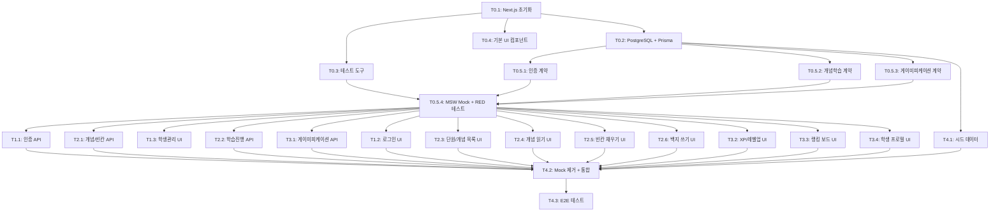

# TASKS: MathLab — AI 개발 파트너용 태스크 목록

## MVP 캡슐

| # | 항목 | 내용 |
|---|------|------|
| 1 | 목표 | 초중등 학생들이 강의 없이 수학 개념을 자기주도적으로 이해할 수 있는 학원용 학습 프로그램 |
| 2 | 페르소나 | 초중등학생 (학원 소속, 수업 전후 자기주도 학습) |
| 3 | 핵심 기능 | FEAT-1: 단계적 개념 학습 (읽기→빈칸→백지) |
| 4 | 성공 지표 (노스스타) | 백지 쓰기 단계까지 도달한 학생 비율 |
| 5 | 입력 지표 | 주간 로그인 횟수, 단계별 완료율 |
| 6 | 비기능 요구 | 모든 기기 반응형 웹 (PC/태블릿/스마트폰) |
| 7 | Out-of-scope | 외부 API 연동, 학부모 카카오톡 알림, 학원 내 상점 |
| 8 | Top 리스크 | 학생들이 초기 흥미를 잃고 사용을 중단할 수 있음 |
| 9 | 완화/실험 | 포인트/랭킹/레벨업 게이미피케이션으로 지속 동기 부여 |
| 10 | 다음 단계 | Phase 0 프로젝트 셋업 실행 |

---

## 기술 스택 요약

| 항목 | 선택 |
|------|------|
| 프레임워크 | Next.js 15 (App Router) |
| 언어 | TypeScript 5+ |
| 스타일링 | TailwindCSS 4 |
| 상태관리 | Zustand |
| ORM | Prisma |
| 인증 | NextAuth.js (Credentials) |
| 검증 | Zod |
| 애니메이션 | Framer Motion |
| DB | PostgreSQL 16 |
| 테스트 | Vitest + React Testing Library + MSW + Playwright |
| 호스팅 | Vercel + Supabase |

---

## 마일스톤 개요

| 마일스톤 | Phase | 설명 | 주요 기능 |
|----------|-------|------|----------|
| M0 | Phase 0 | 프로젝트 셋업 | 초기화, 의존성, 도구 설정 |
| M0.5 | Phase 0 | 계약 & 테스트 설계 | API 계약, Zod 스키마, MSW Mock, RED 테스트 |
| M1 | Phase 1 | FEAT-0 인증/계정 관리 | 로그인, 학생 계정 CRUD |
| M2 | Phase 2 | FEAT-1 단계적 개념 학습 | 읽기→빈칸→백지 4단계 학습 |
| M3 | Phase 3 | FEAT-1 게이미피케이션 | 포인트/레벨/랭킹 |
| M4 | Phase 4 | 통합 & E2E 검증 | Mock 제거, E2E 테스트, 시드 데이터 |

---

## M0: 프로젝트 셋업

### [] Phase 0, T0.1: Next.js 프로젝트 초기화

**담당**: frontend-specialist

**작업 내용**:
- `create-next-app`으로 Next.js 15 프로젝트 생성 (App Router, TypeScript, TailwindCSS)
- `07-coding-convention.md` 섹션 2.1의 디렉토리 구조 생성
- TailwindCSS 4 설정 (`05-design-system.md` 컬러 토큰 반영)
- Prettier + ESLint 설정 (`07-coding-convention.md` 섹션 8)

**산출물**:
- `package.json`
- `next.config.ts`
- `tailwind.config.ts`
- `tsconfig.json`
- `.eslintrc.json`
- `.prettierrc`
- `.gitignore`
- `src/app/layout.tsx` (기본 레이아웃)
- `src/app/page.tsx` (루트 페이지)

**완료 조건**:
- [ ] `npm run dev`로 로컬 서버 정상 실행
- [ ] `npm run lint` 통과
- [ ] `npx tsc --noEmit` 통과
- [ ] TailwindCSS 컬러 토큰이 설정에 반영됨

---

### [] Phase 0, T0.2: PostgreSQL + Prisma 설정

**담당**: database-specialist

**작업 내용**:
- Docker Compose로 PostgreSQL 16 컨테이너 설정
- Prisma 설치 및 초기 설정
- `04-database-design.md`의 전체 ERD를 Prisma 스키마로 변환
- 초기 마이그레이션 실행
- 시드 스크립트 기본 구조 생성

**산출물**:
- `docker-compose.yml`
- `prisma/schema.prisma` (전체 모델: User, Session, Subject, Concept, BlankExercise, LearningProgress, PointTransaction, StudentProfile)
- `prisma/seed.ts` (기본 구조)
- `src/lib/db.ts` (Prisma 클라이언트 싱글톤)
- `.env.example`

**완료 조건**:
- [ ] `docker compose up -d`로 PostgreSQL 실행
- [ ] `npx prisma migrate dev`로 마이그레이션 성공
- [ ] `npx prisma studio`로 모든 테이블 확인
- [ ] Prisma 스키마가 `04-database-design.md` ERD와 일치

---

### [] Phase 0, T0.3: 테스트 도구 설정

**담당**: test-specialist

**작업 내용**:
- Vitest 설치 및 설정 (Next.js 호환)
- React Testing Library 설치
- MSW (Mock Service Worker) 설치 및 기본 설정
- Playwright 설치 및 기본 설정
- 테스트 헬퍼/유틸 기본 구조

**산출물**:
- `vitest.config.ts`
- `src/mocks/server.ts` (MSW 서버 설정)
- `src/mocks/handlers/index.ts` (핸들러 엔트리)
- `playwright.config.ts`
- `src/__tests__/setup.ts` (테스트 셋업)
- 샘플 테스트 1개 (통과 확인용)

**완료 조건**:
- [ ] `npm run test` 실행 시 샘플 테스트 통과
- [ ] `npx playwright test` 실행 가능 (브라우저 설치 포함)
- [ ] MSW가 테스트 환경에서 정상 동작

---

### [] Phase 0, T0.4: 기본 UI 컴포넌트 (Design System)

**담당**: frontend-specialist

**작업 내용**:
- `05-design-system.md`의 기본 컴포넌트 구현
- Button (Primary/Secondary/Ghost, 3 사이즈)
- Card 컴포넌트
- Input 컴포넌트 (기본 텍스트 입력)
- ProgressBar 컴포넌트
- Framer Motion 설치

**산출물**:
- `src/components/ui/Button.tsx`
- `src/components/ui/Card.tsx`
- `src/components/ui/Input.tsx`
- `src/components/ui/ProgressBar.tsx`
- `src/components/ui/index.ts` (배럴 export)

**완료 조건**:
- [ ] 모든 컴포넌트가 TypeScript 타입 완전
- [ ] TailwindCSS로 `05-design-system.md` 스타일 반영
- [ ] 반응형 (mobile/tablet/desktop) 대응
- [ ] `npm run lint` 통과

---

## M0.5: 계약 & 테스트 설계

### [] Phase 0, T0.5.1: 인증 API 계약 + Zod 스키마

**담당**: backend-specialist

**작업 내용**:
- `02-trd.md` 섹션 8.2 FEAT-0 API 엔드포인트를 기반으로 계약 정의
- 인증 관련 Zod 검증 스키마 작성
- NextAuth.js Credentials Provider 계약 타입 정의

**산출물**:
- `contracts/types.ts` (공통 응답 타입)
- `contracts/auth.contract.ts` (로그인, 로그아웃, 세션 확인)
- `src/lib/schemas/auth.ts` (loginSchema, createUserSchema 등)

**완료 조건**:
- [ ] 모든 API 엔드포인트의 요청/응답 타입 정의
- [ ] Zod 스키마가 계약 타입과 일치
- [ ] TypeScript 컴파일 통과

---

### [] Phase 0, T0.5.2: 개념 학습 API 계약 + Zod 스키마

**담당**: backend-specialist

**작업 내용**:
- `02-trd.md` 섹션 8.2 FEAT-1 개념/학습 API 엔드포인트 기반 계약 정의
- 개념 조회, 빈칸 문제, 학습 진행 관련 Zod 스키마

**산출물**:
- `contracts/concept.contract.ts` (개념 목록, 상세, 빈칸 조회)
- `contracts/learning.contract.ts` (진행 기록, 빈칸 제출, 백지 제출)
- `src/lib/schemas/concept.ts`
- `src/lib/schemas/learning.ts`

**완료 조건**:
- [ ] 4단계 학습 흐름의 모든 API 계약 정의
- [ ] 빈칸 답안 제출/채점 요청·응답 타입 포함
- [ ] TypeScript 컴파일 통과

---

### [] Phase 0, T0.5.3: 게이미피케이션 API 계약 + Zod 스키마

**담당**: backend-specialist

**작업 내용**:
- `02-trd.md` 섹션 8.2 게이미피케이션 API 기반 계약 정의
- 포인트, 랭킹, 레벨 관련 Zod 스키마
- XP/레벨 계산 유틸리티 함수 정의

**산출물**:
- `contracts/gamification.contract.ts` (포인트 조회, 랭킹, 포인트 지급)
- `src/lib/schemas/gamification.ts`
- `src/lib/utils/xp.ts` (레벨 계산 함수: `04-database-design.md` 레벨업 기준 참조)

**완료 조건**:
- [ ] 포인트 획득 기준표 (`04-database-design.md` 섹션 2.6)와 일치
- [ ] 레벨업 계산 로직이 XP 테이블과 일치
- [ ] TypeScript 컴파일 통과

---

### [] Phase 0, T0.5.4: MSW Mock 핸들러 + RED 테스트 작성

**담당**: test-specialist

**작업 내용**:
- 모든 API 계약(T0.5.1~T0.5.3)을 MSW Mock 핸들러로 구현
- Mock 데이터 생성 (학생 계정, 샘플 개념, 빈칸 문제)
- 각 API 엔드포인트의 기본 테스트 작성 (🔴 RED 상태)

**산출물**:
- `src/mocks/handlers/auth.ts`
- `src/mocks/handlers/concept.ts`
- `src/mocks/handlers/learning.ts`
- `src/mocks/handlers/gamification.ts`
- `src/mocks/data/users.ts`
- `src/mocks/data/concepts.ts`
- `src/__tests__/api/auth.test.ts` (🔴 RED)
- `src/__tests__/api/concept.test.ts` (🔴 RED)
- `src/__tests__/api/learning.test.ts` (🔴 RED)
- `src/__tests__/api/gamification.test.ts` (🔴 RED)

**완료 조건**:
- [ ] 모든 MSW Mock 핸들러가 계약과 일치하는 응답 반환
- [ ] 모든 테스트가 RED 상태 (실패) — API Route 미구현이므로 정상
- [ ] Mock 데이터가 `04-database-design.md` 스키마와 일치

---

## M1: FEAT-0 인증/계정 관리

### [] Phase 1, T1.1: NextAuth.js 인증 API RED→GREEN

**담당**: backend-specialist

**Git Worktree 설정**:
```bash
# 1. Worktree 생성
git worktree add ../mathlab-phase1-auth -b phase/1-auth
cd ../mathlab-phase1-auth

# 2. 작업 완료 후 병합 (사용자 승인 필요)
# git checkout main
# git merge --no-ff phase/1-auth
# git worktree remove ../mathlab-phase1-auth
```

**TDD 사이클**:

1. **RED**: 테스트 작성 (실패 확인)
   ```bash
   # 테스트 파일: src/__tests__/api/auth.test.ts (M0.5에서 작성됨)
   npx vitest run src/__tests__/api/auth.test.ts  # Expected: FAILED
   ```

2. **GREEN**: 최소 구현 (테스트 통과)
   ```bash
   # 구현 파일:
   # - src/lib/auth.ts (NextAuth 설정, Credentials Provider)
   # - src/app/api/auth/[...nextauth]/route.ts
   # - src/app/api/users/route.ts (학생 계정 생성)
   # - src/app/api/users/[id]/route.ts (학생 정보 수정)
   npx vitest run src/__tests__/api/auth.test.ts  # Expected: PASSED
   ```

3. **REFACTOR**: 리팩토링 (테스트 유지)
   - 코드 정리, 중복 제거
   - 테스트 계속 통과 확인

**산출물**:
- `src/lib/auth.ts` (NextAuth 설정)
- `src/app/api/auth/[...nextauth]/route.ts`
- `src/app/api/users/route.ts` (POST: 학생 생성, GET: 학생 목록)
- `src/app/api/users/[id]/route.ts` (PATCH: 정보 수정)

**인수 조건**:
- [ ] 테스트 먼저 작성됨 (RED 확인)
- [ ] 학원 계정(username/password)으로 로그인 성공
- [ ] Teacher 역할이 Student 계정 생성 가능
- [ ] Student 역할은 계정 생성 불가 (403)
- [ ] 비밀번호 bcrypt 해싱 확인
- [ ] 모든 테스트 통과 (GREEN)
- [ ] 커버리지 >= 80%

**완료 시**:
- [ ] 사용자 승인 후 main 브랜치에 병합
- [ ] worktree 정리: `git worktree remove ../mathlab-phase1-auth`

---

### [] Phase 1, T1.2: 로그인 페이지 UI RED→GREEN

**담당**: frontend-specialist

**Git Worktree 설정**:
```bash
git worktree add ../mathlab-phase1-login-ui -b phase/1-login-ui
cd ../mathlab-phase1-login-ui
```

**의존성**: T1.1 (인증 API) — **MSW Mock 사용으로 독립 개발 가능**

**TDD 사이클**:

1. **RED**: 테스트 작성 (실패 확인)
   ```bash
   # 테스트 파일: src/__tests__/components/auth/LoginPage.test.tsx
   npx vitest run src/__tests__/components/auth/LoginPage.test.tsx  # Expected: FAILED
   ```

2. **GREEN**: 최소 구현 (테스트 통과)
   ```bash
   # 구현 파일:
   # - src/app/(auth)/login/page.tsx
   # - src/components/auth/LoginForm.tsx
   # - src/hooks/useAuth.ts
   npx vitest run src/__tests__/components/auth/LoginPage.test.tsx  # Expected: PASSED
   ```

3. **REFACTOR**: 리팩토링 (테스트 유지)

**Mock 설정**:
```typescript
// src/mocks/handlers/auth.ts (M0.5에서 생성됨)
// MSW가 로그인 API를 Mock하므로 BE 없이 개발 가능
```

**산출물**:
- `src/app/(auth)/login/page.tsx`
- `src/components/auth/LoginForm.tsx`
- `src/hooks/useAuth.ts`
- `src/__tests__/components/auth/LoginPage.test.tsx`

**인수 조건**:
- [ ] 테스트 먼저 작성됨 (RED 확인)
- [ ] 아이디/비밀번호 입력 → 로그인 성공 시 대시보드 이동
- [ ] 로그인 실패 시 에러 메시지 표시
- [ ] `05-design-system.md` 스타일 적용 (게임 스타일 톤)
- [ ] 반응형 (mobile/tablet/desktop)
- [ ] 모든 테스트 통과 (GREEN)

**완료 시**:
- [ ] 사용자 승인 후 main 브랜치에 병합
- [ ] worktree 정리: `git worktree remove ../mathlab-phase1-login-ui`

---

### [] Phase 1, T1.3: 학생 계정 관리 UI (선생님) RED→GREEN

**담당**: frontend-specialist

**Git Worktree 설정**:
```bash
git worktree add ../mathlab-phase1-student-mgmt -b phase/1-student-mgmt
cd ../mathlab-phase1-student-mgmt
```

**의존성**: T1.1 (학생 API) — **MSW Mock 사용으로 독립 개발 가능**

**TDD 사이클**:

1. **RED**: 테스트 작성 (실패 확인)
   ```bash
   # 테스트 파일: src/__tests__/components/teacher/StudentManagement.test.tsx
   npx vitest run src/__tests__/components/teacher/StudentManagement.test.tsx  # Expected: FAILED
   ```

2. **GREEN**: 최소 구현 (테스트 통과)
   ```bash
   # 구현 파일:
   # - src/app/(teacher)/dashboard/page.tsx
   # - src/app/(teacher)/students/page.tsx
   # - src/components/teacher/StudentList.tsx
   # - src/components/teacher/CreateStudentForm.tsx
   npx vitest run src/__tests__/components/teacher/StudentManagement.test.tsx  # Expected: PASSED
   ```

3. **REFACTOR**: 리팩토링 (테스트 유지)

**산출물**:
- `src/app/(teacher)/dashboard/page.tsx`
- `src/app/(teacher)/students/page.tsx`
- `src/components/teacher/StudentList.tsx`
- `src/components/teacher/CreateStudentForm.tsx`
- `src/__tests__/components/teacher/StudentManagement.test.tsx`

**인수 조건**:
- [ ] 테스트 먼저 작성됨 (RED 확인)
- [ ] 학생 목록 조회 (이름, 학년, 아이디 표시)
- [ ] 학생 계정 생성 (이름, 학년, 아이디, 초기 비밀번호)
- [ ] 비밀번호 초기화 기능
- [ ] Teacher 역할만 접근 가능 (미들웨어)
- [ ] 모든 테스트 통과 (GREEN)

**완료 시**:
- [ ] 사용자 승인 후 main 브랜치에 병합
- [ ] worktree 정리: `git worktree remove ../mathlab-phase1-student-mgmt`

---

## M2: FEAT-1 단계적 개념 학습

### [] Phase 2, T2.1: 개념/빈칸 CRUD API RED→GREEN

**담당**: backend-specialist

**Git Worktree 설정**:
```bash
git worktree add ../mathlab-phase2-concept-api -b phase/2-concept-api
cd ../mathlab-phase2-concept-api
```

**TDD 사이클**:

1. **RED**: 테스트 작성 (실패 확인)
   ```bash
   # 테스트 파일: src/__tests__/api/concept.test.ts (M0.5에서 작성됨)
   npx vitest run src/__tests__/api/concept.test.ts  # Expected: FAILED
   ```

2. **GREEN**: 최소 구현 (테스트 통과)
   ```bash
   # 구현 파일:
   # - src/app/api/concepts/route.ts (GET: 개념 목록)
   # - src/app/api/concepts/[id]/route.ts (GET: 개념 상세)
   # - src/app/api/concepts/[id]/blanks/route.ts (GET: 빈칸 문제)
   npx vitest run src/__tests__/api/concept.test.ts  # Expected: PASSED
   ```

3. **REFACTOR**: 리팩토링 (테스트 유지)

**산출물**:
- `src/app/api/concepts/route.ts`
- `src/app/api/concepts/[id]/route.ts`
- `src/app/api/concepts/[id]/blanks/route.ts`

**인수 조건**:
- [ ] 테스트 먼저 작성됨 (RED 확인)
- [ ] 단원별 개념 목록 조회 (학년 필터링)
- [ ] 개념 상세 조회 (fullContent + visualAssets)
- [ ] 빈칸 문제 조회 (level 파라미터: 1=쉬움, 2=어려움)
- [ ] 인증된 사용자만 접근 가능
- [ ] 모든 테스트 통과 (GREEN)
- [ ] 커버리지 >= 80%

**완료 시**:
- [ ] 사용자 승인 후 main 브랜치에 병합
- [ ] worktree 정리: `git worktree remove ../mathlab-phase2-concept-api`

---

### [] Phase 2, T2.2: 학습 진행 API RED→GREEN

**담당**: backend-specialist

**Git Worktree 설정**:
```bash
git worktree add ../mathlab-phase2-learning-api -b phase/2-learning-api
cd ../mathlab-phase2-learning-api
```

**TDD 사이클**:

1. **RED**: 테스트 작성 (실패 확인)
   ```bash
   # 테스트 파일: src/__tests__/api/learning.test.ts (M0.5에서 작성됨)
   npx vitest run src/__tests__/api/learning.test.ts  # Expected: FAILED
   ```

2. **GREEN**: 최소 구현 (테스트 통과)
   ```bash
   # 구현 파일:
   # - src/app/api/learning/progress/route.ts (GET: 진도 조회, POST: 단계 완료)
   # - src/app/api/learning/blank-submit/route.ts (POST: 빈칸 답안 제출)
   # - src/app/api/learning/blank-page-submit/route.ts (POST: 백지 답안 제출)
   npx vitest run src/__tests__/api/learning.test.ts  # Expected: PASSED
   ```

3. **REFACTOR**: 리팩토링 (테스트 유지)

**산출물**:
- `src/app/api/learning/progress/route.ts`
- `src/app/api/learning/blank-submit/route.ts`
- `src/app/api/learning/blank-page-submit/route.ts`

**인수 조건**:
- [ ] 테스트 먼저 작성됨 (RED 확인)
- [ ] 학생별 개념별 학습 진도 조회
- [ ] 각 단계(READING/BLANK_EASY/BLANK_HARD/BLANK_PAGE) 완료 기록
- [ ] 빈칸 답안 제출 → 자동 채점 → 정답/오답 반환
- [ ] 백지 쓰기 제출 → 점수(score) 기록
- [ ] 단계 완료 시 다음 단계 해금 로직
- [ ] 모든 테스트 통과 (GREEN)
- [ ] 커버리지 >= 80%

**완료 시**:
- [ ] 사용자 승인 후 main 브랜치에 병합
- [ ] worktree 정리: `git worktree remove ../mathlab-phase2-learning-api`

---

### [] Phase 2, T2.3: 단원/개념 목록 UI RED→GREEN

**담당**: frontend-specialist

**Git Worktree 설정**:
```bash
git worktree add ../mathlab-phase2-concept-list-ui -b phase/2-concept-list-ui
cd ../mathlab-phase2-concept-list-ui
```

**의존성**: T2.1 (개념 API) — **MSW Mock 사용으로 독립 개발 가능**

**TDD 사이클**:

1. **RED**: 테스트 작성 (실패 확인)
   ```bash
   # 테스트 파일: src/__tests__/components/learning/SubjectList.test.tsx
   npx vitest run src/__tests__/components/learning/SubjectList.test.tsx  # Expected: FAILED
   ```

2. **GREEN**: 최소 구현 (테스트 통과)
   ```bash
   # 구현 파일:
   # - src/app/(student)/dashboard/page.tsx (학생 메인)
   # - src/app/(student)/subjects/page.tsx (단원 목록)
   # - src/app/(student)/concepts/[id]/page.tsx (개념 학습 진입)
   # - src/components/learning/SubjectCard.tsx
   # - src/components/learning/ConceptCard.tsx
   # - src/components/learning/StageProgress.tsx
   npx vitest run src/__tests__/components/learning/SubjectList.test.tsx  # Expected: PASSED
   ```

3. **REFACTOR**: 리팩토링 (테스트 유지)

**산출물**:
- `src/app/(student)/dashboard/page.tsx`
- `src/app/(student)/subjects/page.tsx`
- `src/app/(student)/concepts/[id]/page.tsx`
- `src/components/learning/SubjectCard.tsx`
- `src/components/learning/ConceptCard.tsx`
- `src/components/learning/StageProgress.tsx` (4단계 진행 표시 바)
- `src/hooks/useLearning.ts`
- `src/__tests__/components/learning/SubjectList.test.tsx`

**인수 조건**:
- [ ] 테스트 먼저 작성됨 (RED 확인)
- [ ] 학년별 단원 목록 표시 (학생 학년 기반 필터)
- [ ] 단원 클릭 → 개념 목록 표시
- [ ] 각 개념의 4단계 진행 상태 시각화 (StageProgress)
- [ ] `05-design-system.md` 스테이지 컬러 적용
- [ ] 반응형 (mobile/tablet/desktop)
- [ ] 모든 테스트 통과 (GREEN)

**완료 시**:
- [ ] 사용자 승인 후 main 브랜치에 병합
- [ ] worktree 정리: `git worktree remove ../mathlab-phase2-concept-list-ui`

---

### [] Phase 2, T2.4: 개념 읽기 (Stage 1) UI RED→GREEN

**담당**: frontend-specialist

**Git Worktree 설정**:
```bash
git worktree add ../mathlab-phase2-reading-ui -b phase/2-reading-ui
cd ../mathlab-phase2-reading-ui
```

**의존성**: T2.2 (학습 진행 API) — **MSW Mock 사용으로 독립 개발 가능**

**TDD 사이클**:

1. **RED**: 테스트 작성 (실패 확인)
   ```bash
   # 테스트 파일: src/__tests__/components/learning/ConceptReader.test.tsx
   npx vitest run src/__tests__/components/learning/ConceptReader.test.tsx  # Expected: FAILED
   ```

2. **GREEN**: 최소 구현 (테스트 통과)
   ```bash
   # 구현 파일:
   # - src/components/learning/ConceptReader.tsx
   npx vitest run src/__tests__/components/learning/ConceptReader.test.tsx  # Expected: PASSED
   ```

3. **REFACTOR**: 리팩토링 (테스트 유지)

**산출물**:
- `src/components/learning/ConceptReader.tsx`
- `src/__tests__/components/learning/ConceptReader.test.tsx`

**인수 조건**:
- [ ] 테스트 먼저 작성됨 (RED 확인)
- [ ] 개념 전문(fullContent)을 시각적으로 표시
- [ ] Markdown 렌더링 + 이미지/그림 표시
- [ ] 읽기 완료 버튼 → API 호출(READING 단계 완료)
- [ ] 완료 시 "+5 XP 획득!" 피드백 (토스트)
- [ ] 자동으로 Stage 2(빈칸 쉬움)로 이동
- [ ] 반응형 (mobile: 스크롤, desktop: 넓은 레이아웃)
- [ ] 모든 테스트 통과 (GREEN)

**완료 시**:
- [ ] 사용자 승인 후 main 브랜치에 병합
- [ ] worktree 정리: `git worktree remove ../mathlab-phase2-reading-ui`

---

### [] Phase 2, T2.5: 빈칸 채우기 (Stage 2 & 3) UI RED→GREEN

**담당**: frontend-specialist

**Git Worktree 설정**:
```bash
git worktree add ../mathlab-phase2-blank-ui -b phase/2-blank-ui
cd ../mathlab-phase2-blank-ui
```

**의존성**: T2.2 (학습 진행 API) — **MSW Mock 사용으로 독립 개발 가능**

**TDD 사이클**:

1. **RED**: 테스트 작성 (실패 확인)
   ```bash
   # 테스트 파일: src/__tests__/components/learning/BlankExercise.test.tsx
   npx vitest run src/__tests__/components/learning/BlankExercise.test.tsx  # Expected: FAILED
   ```

2. **GREEN**: 최소 구현 (테스트 통과)
   ```bash
   # 구현 파일:
   # - src/components/learning/BlankExercise.tsx
   # - src/components/learning/BlankInput.tsx (빈칸 입력 필드)
   npx vitest run src/__tests__/components/learning/BlankExercise.test.tsx  # Expected: PASSED
   ```

3. **REFACTOR**: 리팩토링 (테스트 유지)

**산출물**:
- `src/components/learning/BlankExercise.tsx`
- `src/components/learning/BlankInput.tsx`
- `src/__tests__/components/learning/BlankExercise.test.tsx`

**인수 조건**:
- [ ] 테스트 먼저 작성됨 (RED 확인)
- [ ] templateText에서 `{{N}}` 위치를 빈칸 입력 필드로 변환
- [ ] level=1 (쉬움): 일부 핵심 키워드만 빈칸
- [ ] level=2 (어려움): 대부분의 내용이 빈칸
- [ ] 정답 입력 → 에메랄드 테두리 + 체크 아이콘 + 바운스 애니메이션
- [ ] 오답 입력 → 코랄 레드 테두리 + X 아이콘 + 셰이크 애니메이션
- [ ] 힌트 버튼 → 앰버 테두리 + 힌트 텍스트 툴팁
- [ ] 모든 빈칸 완료 시 → XP 획득 (+10/+15) + 다음 단계 이동
- [ ] `05-design-system.md` 섹션 5.2 빈칸 입력 필드 스타일 적용
- [ ] 모든 테스트 통과 (GREEN)

**완료 시**:
- [ ] 사용자 승인 후 main 브랜치에 병합
- [ ] worktree 정리: `git worktree remove ../mathlab-phase2-blank-ui`

---

### [] Phase 2, T2.6: 백지 쓰기 (Stage 4) UI RED→GREEN

**담당**: frontend-specialist

**Git Worktree 설정**:
```bash
git worktree add ../mathlab-phase2-blankpage-ui -b phase/2-blankpage-ui
cd ../mathlab-phase2-blankpage-ui
```

**의존성**: T2.2 (학습 진행 API) — **MSW Mock 사용으로 독립 개발 가능**

**TDD 사이클**:

1. **RED**: 테스트 작성 (실패 확인)
   ```bash
   # 테스트 파일: src/__tests__/components/learning/BlankPage.test.tsx
   npx vitest run src/__tests__/components/learning/BlankPage.test.tsx  # Expected: FAILED
   ```

2. **GREEN**: 최소 구현 (테스트 통과)
   ```bash
   # 구현 파일:
   # - src/components/learning/BlankPage.tsx
   npx vitest run src/__tests__/components/learning/BlankPage.test.tsx  # Expected: PASSED
   ```

3. **REFACTOR**: 리팩토링 (테스트 유지)

**산출물**:
- `src/components/learning/BlankPage.tsx`
- `src/__tests__/components/learning/BlankPage.test.tsx`

**인수 조건**:
- [ ] 테스트 먼저 작성됨 (RED 확인)
- [ ] 완전히 빈 화면에 텍스트 입력 영역 제공
- [ ] 학생이 개념을 직접 작성
- [ ] 제출 → 서버 채점 → 점수(0~100) 표시
- [ ] 통과(70점 이상) → "🏆 스테이지 클리어! +30 XP!" 모달
- [ ] 미달(70점 미만) → 부족한 부분 하이라이트 + Stage 2 복귀 옵션
- [ ] 모바일: 터치 키보드 최적화 (입력 영역 크게)
- [ ] 모든 테스트 통과 (GREEN)

**완료 시**:
- [ ] 사용자 승인 후 main 브랜치에 병합
- [ ] worktree 정리: `git worktree remove ../mathlab-phase2-blankpage-ui`

---

## M3: FEAT-1 게이미피케이션

### [] Phase 3, T3.1: 게이미피케이션 API RED→GREEN

**담당**: backend-specialist

**Git Worktree 설정**:
```bash
git worktree add ../mathlab-phase3-gamification-api -b phase/3-gamification-api
cd ../mathlab-phase3-gamification-api
```

**TDD 사이클**:

1. **RED**: 테스트 작성 (실패 확인)
   ```bash
   # 테스트 파일: src/__tests__/api/gamification.test.ts (M0.5에서 작성됨)
   npx vitest run src/__tests__/api/gamification.test.ts  # Expected: FAILED
   ```

2. **GREEN**: 최소 구현 (테스트 통과)
   ```bash
   # 구현 파일:
   # - src/app/api/gamification/points/route.ts (GET: 내 포인트/레벨)
   # - src/app/api/gamification/ranking/route.ts (GET: 랭킹 보드)
   # - src/app/api/gamification/award/route.ts (POST: 포인트 지급 - 내부)
   npx vitest run src/__tests__/api/gamification.test.ts  # Expected: PASSED
   ```

3. **REFACTOR**: 리팩토링 (테스트 유지)

**산출물**:
- `src/app/api/gamification/points/route.ts`
- `src/app/api/gamification/ranking/route.ts`
- `src/app/api/gamification/award/route.ts`

**인수 조건**:
- [ ] 테스트 먼저 작성됨 (RED 확인)
- [ ] 학생의 현재 XP/레벨/스트릭 조회
- [ ] 포인트 지급 시 StudentProfile 자동 업데이트 (totalXp, level)
- [ ] 레벨업 기준표(`04-database-design.md` 섹션 2.7)와 일치하는 레벨 계산
- [ ] 랭킹 보드: totalXp 내림차순 정렬, 상위 N명 반환
- [ ] 연속 학습 스트릭 계산 (lastActiveAt 기반)
- [ ] 모든 테스트 통과 (GREEN)
- [ ] 커버리지 >= 80%

**완료 시**:
- [ ] 사용자 승인 후 main 브랜치에 병합
- [ ] worktree 정리: `git worktree remove ../mathlab-phase3-gamification-api`

---

### [] Phase 3, T3.2: XP/레벨업/포인트 UI 컴포넌트 RED→GREEN

**담당**: frontend-specialist

**Git Worktree 설정**:
```bash
git worktree add ../mathlab-phase3-xp-ui -b phase/3-xp-ui
cd ../mathlab-phase3-xp-ui
```

**의존성**: T3.1 (게이미피케이션 API) — **MSW Mock 사용으로 독립 개발 가능**

**TDD 사이클**:

1. **RED**: 테스트 작성 (실패 확인)
   ```bash
   # 테스트 파일: src/__tests__/components/gamification/XpSystem.test.tsx
   npx vitest run src/__tests__/components/gamification/XpSystem.test.tsx  # Expected: FAILED
   ```

2. **GREEN**: 최소 구현 (테스트 통과)
   ```bash
   # 구현 파일:
   # - src/components/gamification/XpBadge.tsx
   # - src/components/gamification/LevelUpModal.tsx
   # - src/components/gamification/PointToast.tsx
   # - src/components/gamification/StreakBadge.tsx
   # - src/stores/gamificationStore.ts
   npx vitest run src/__tests__/components/gamification/XpSystem.test.tsx  # Expected: PASSED
   ```

3. **REFACTOR**: 리팩토링 (테스트 유지)

**산출물**:
- `src/components/gamification/XpBadge.tsx` (XP 뱃지 + 레벨 표시)
- `src/components/gamification/LevelUpModal.tsx` (레벨업 축하 모달)
- `src/components/gamification/PointToast.tsx` ("+10 XP!" 토스트)
- `src/components/gamification/StreakBadge.tsx` ("🔥 5일 연속!" 뱃지)
- `src/stores/gamificationStore.ts` (Zustand)
- `src/hooks/useGamification.ts`
- `src/__tests__/components/gamification/XpSystem.test.tsx`

**인수 조건**:
- [ ] 테스트 먼저 작성됨 (RED 확인)
- [ ] XpBadge: 골드 그라데이션 pill, 현재 XP/레벨 표시
- [ ] LevelUpModal: 컨페티 애니메이션, 숫자 카운트업 (Framer Motion)
- [ ] PointToast: 상단 슬라이드 다운, 2초 후 자동 사라짐
- [ ] StreakBadge: 연속 학습 일수 + 불꽃 아이콘
- [ ] `05-design-system.md` 섹션 6 게임 피드백 UI 스타일 일치
- [ ] 모든 테스트 통과 (GREEN)

**완료 시**:
- [ ] 사용자 승인 후 main 브랜치에 병합
- [ ] worktree 정리: `git worktree remove ../mathlab-phase3-xp-ui`

---

### [] Phase 3, T3.3: 랭킹 보드 UI RED→GREEN

**담당**: frontend-specialist

**Git Worktree 설정**:
```bash
git worktree add ../mathlab-phase3-ranking-ui -b phase/3-ranking-ui
cd ../mathlab-phase3-ranking-ui
```

**의존성**: T3.1 (랭킹 API) — **MSW Mock 사용으로 독립 개발 가능**

**TDD 사이클**:

1. **RED**: 테스트 작성 (실패 확인)
   ```bash
   # 테스트 파일: src/__tests__/components/gamification/RankingBoard.test.tsx
   npx vitest run src/__tests__/components/gamification/RankingBoard.test.tsx  # Expected: FAILED
   ```

2. **GREEN**: 최소 구현 (테스트 통과)
   ```bash
   # 구현 파일:
   # - src/app/(student)/ranking/page.tsx
   # - src/components/gamification/RankingBoard.tsx
   # - src/components/gamification/RankingCard.tsx
   npx vitest run src/__tests__/components/gamification/RankingBoard.test.tsx  # Expected: PASSED
   ```

3. **REFACTOR**: 리팩토링 (테스트 유지)

**산출물**:
- `src/app/(student)/ranking/page.tsx`
- `src/components/gamification/RankingBoard.tsx`
- `src/components/gamification/RankingCard.tsx`
- `src/__tests__/components/gamification/RankingBoard.test.tsx`

**인수 조건**:
- [ ] 테스트 먼저 작성됨 (RED 확인)
- [ ] 1/2/3등: 골드/실버/브론즈 특별 카드 스타일
- [ ] 내 순위: Primary 컬러 강조 + "나" 뱃지
- [ ] 각 카드: 이름, 레벨, 총 XP 표시
- [ ] 다음 순위까지 남은 XP 표시 ("1등까지 50 XP!")
- [ ] `05-design-system.md` 섹션 5.6 랭킹 카드 스타일 일치
- [ ] 반응형 (mobile: 단일 컬럼, desktop: 넓은 리스트)
- [ ] 모든 테스트 통과 (GREEN)

**완료 시**:
- [ ] 사용자 승인 후 main 브랜치에 병합
- [ ] worktree 정리: `git worktree remove ../mathlab-phase3-ranking-ui`

---

### [] Phase 3, T3.4: 학생 프로필 UI RED→GREEN

**담당**: frontend-specialist

**Git Worktree 설정**:
```bash
git worktree add ../mathlab-phase3-profile-ui -b phase/3-profile-ui
cd ../mathlab-phase3-profile-ui
```

**의존성**: T3.1 (포인트 API) — **MSW Mock 사용으로 독립 개발 가능**

**TDD 사이클**:

1. **RED**: 테스트 작성 (실패 확인)
   ```bash
   # 테스트 파일: src/__tests__/components/gamification/StudentProfile.test.tsx
   npx vitest run src/__tests__/components/gamification/StudentProfile.test.tsx  # Expected: FAILED
   ```

2. **GREEN**: 최소 구현 (테스트 통과)
   ```bash
   # 구현 파일:
   # - src/app/(student)/profile/page.tsx
   # - src/components/gamification/ProfileCard.tsx
   npx vitest run src/__tests__/components/gamification/StudentProfile.test.tsx  # Expected: PASSED
   ```

3. **REFACTOR**: 리팩토링 (테스트 유지)

**산출물**:
- `src/app/(student)/profile/page.tsx`
- `src/components/gamification/ProfileCard.tsx`
- `src/__tests__/components/gamification/StudentProfile.test.tsx`

**인수 조건**:
- [ ] 테스트 먼저 작성됨 (RED 확인)
- [ ] 현재 레벨 + 다음 레벨까지 XP 프로그레스 바
- [ ] 총 누적 XP
- [ ] 현재/최장 연속 학습 스트릭
- [ ] 학습 완료한 개념 수 통계
- [ ] 모든 테스트 통과 (GREEN)

**완료 시**:
- [ ] 사용자 승인 후 main 브랜치에 병합
- [ ] worktree 정리: `git worktree remove ../mathlab-phase3-profile-ui`

---

## M4: 통합 & E2E 검증

### [] Phase 4, T4.1: 시드 데이터 + 콘텐츠 입력 RED→GREEN

**담당**: database-specialist

**Git Worktree 설정**:
```bash
git worktree add ../mathlab-phase4-seed -b phase/4-seed
cd ../mathlab-phase4-seed
```

**TDD 사이클**:

1. **RED**: 테스트 작성 (실패 확인)
   ```bash
   # 테스트 파일: src/__tests__/seed/seed.test.ts
   npx vitest run src/__tests__/seed/seed.test.ts  # Expected: FAILED
   ```

2. **GREEN**: 최소 구현 (테스트 통과)
   ```bash
   # 구현 파일:
   # - prisma/seed.ts
   npx vitest run src/__tests__/seed/seed.test.ts  # Expected: PASSED
   ```

3. **REFACTOR**: 리팩토링 (테스트 유지)

**산출물**:
- `prisma/seed.ts` (완성본)

**시드 데이터 내용**:
- Admin 계정 1개
- Teacher 계정 2개
- Student 계정 10개
- 초등 수학 단원 3개 (분수, 도형, 비율)
- 각 단원에 개념 3개 (총 9개 개념)
- 각 개념에 빈칸 문제 2개 (쉬움 1, 어려움 1)

**인수 조건**:
- [ ] `npx prisma db seed` 실행 성공
- [ ] 모든 시드 데이터가 DB에 정상 입력
- [ ] 빈칸 문제의 blanks JSON이 유효
- [ ] 모든 테스트 통과 (GREEN)

**완료 시**:
- [ ] 사용자 승인 후 main 브랜치에 병합
- [ ] worktree 정리: `git worktree remove ../mathlab-phase4-seed`

---

### [] Phase 4, T4.2: Mock 제거 + 실제 API 연동 검증

**담당**: test-specialist

**Git Worktree 설정**:
```bash
git worktree add ../mathlab-phase4-integration -b phase/4-integration
cd ../mathlab-phase4-integration
```

**작업 내용**:
- MSW Mock을 실제 API로 전환
- 프론트엔드 컴포넌트가 실제 API와 정상 통신 확인
- 통합 테스트 작성 및 통과

**TDD 사이클**:

1. **RED**: 통합 테스트 작성
   ```bash
   # 테스트 파일: src/__tests__/integration/learning-flow.test.tsx
   npx vitest run src/__tests__/integration/  # Expected: FAILED
   ```

2. **GREEN**: Mock 제거 + 실제 연동
   ```bash
   npx vitest run src/__tests__/integration/  # Expected: PASSED
   ```

**산출물**:
- `src/__tests__/integration/auth-flow.test.tsx`
- `src/__tests__/integration/learning-flow.test.tsx`
- `src/__tests__/integration/gamification-flow.test.tsx`

**인수 조건**:
- [ ] 로그인 → 단원 선택 → 개념 학습 4단계 → XP 획득 전체 흐름 동작
- [ ] 실제 DB에 학습 기록 정상 저장
- [ ] 포인트 지급 + 레벨업 + 랭킹 반영 확인
- [ ] 모든 통합 테스트 통과

**완료 시**:
- [ ] 사용자 승인 후 main 브랜치에 병합
- [ ] worktree 정리: `git worktree remove ../mathlab-phase4-integration`

---

### [] Phase 4, T4.3: E2E 테스트 + 최종 검증

**담당**: test-specialist

**Git Worktree 설정**:
```bash
git worktree add ../mathlab-phase4-e2e -b phase/4-e2e
cd ../mathlab-phase4-e2e
```

**TDD 사이클**:

1. **RED**: E2E 테스트 작성
   ```bash
   # 테스트 파일: e2e/*.spec.ts
   npx playwright test  # Expected: FAILED
   ```

2. **GREEN**: 필요한 수정 후 통과
   ```bash
   npx playwright test  # Expected: PASSED
   ```

**산출물**:
- `e2e/login.spec.ts` (로그인 플로우)
- `e2e/learning-flow.spec.ts` (4단계 학습 전체 플로우)
- `e2e/ranking.spec.ts` (랭킹 확인 플로우)

**인수 조건**:
- [ ] 로그인 → 대시보드 이동 E2E 통과
- [ ] 개념 읽기 → 빈칸(쉬움) → 빈칸(어려움) → 백지 쓰기 전체 E2E 통과
- [ ] XP 획득 → 레벨업 → 랭킹 반영 E2E 통과
- [ ] 모바일 뷰포트에서 주요 플로우 통과
- [ ] 선생님 로그인 → 학생 계정 생성 E2E 통과
- [ ] 전체 커버리지 ≥ 80%

**완료 시**:
- [ ] 사용자 승인 후 main 브랜치에 병합
- [ ] worktree 정리: `git worktree remove ../mathlab-phase4-e2e`

---

## 의존성 그래프



---

## 병렬 실행 가능 태스크

| 그룹 | 동시 실행 가능 태스크 | 조건 |
|------|----------------------|------|
| A | T0.2, T0.3, T0.4 | T0.1 완료 후 |
| B | T0.5.1, T0.5.2, T0.5.3 | T0.2 완료 후 |
| C | T1.1, T1.2, T1.3 | T0.5.4 완료 후 (MSW Mock으로 독립 가능) |
| D | T2.1, T2.2, T2.3, T2.4, T2.5, T2.6 | T0.5.4 완료 후 (MSW Mock으로 독립 가능) |
| E | T3.1, T3.2, T3.3, T3.4 | T0.5.4 완료 후 (MSW Mock으로 독립 가능) |
| F | C, D, E 그룹 전체 | M0.5 완료 후 모두 병렬 실행 가능! |
| G | T4.2 | M1 + M2 + M3 + T4.1 모두 완료 후 |
| H | T4.3 | T4.2 완료 후 |

> **핵심**: M0.5에서 MSW Mock과 RED 테스트를 완성하면,
> M1/M2/M3의 모든 태스크를 **동시에 병렬 개발** 가능합니다!

---

## 태스크 요약 (총 21개)

| Phase | 마일스톤 | 태스크 수 | Worktree |
|-------|----------|----------|----------|
| Phase 0 | M0: 프로젝트 셋업 | 4개 | 불필요 (main) |
| Phase 0 | M0.5: 계약 & 테스트 | 4개 | 불필요 (main) |
| Phase 1 | M1: 인증/계정 | 3개 | 필수 |
| Phase 2 | M2: 개념 학습 | 6개 | 필수 |
| Phase 3 | M3: 게이미피케이션 | 4개 | 필수 |
| Phase 4 | M4: 통합 & E2E | 3개 | 필수 |
| **합계** | | **24개** | |
